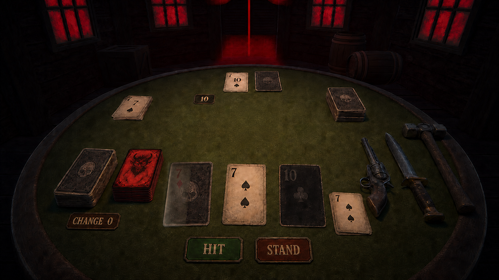
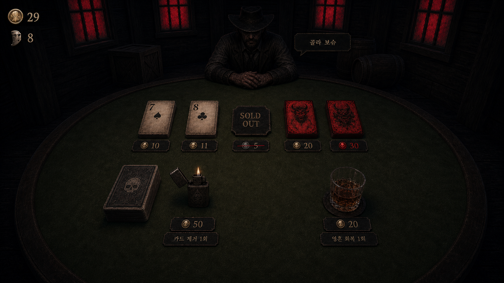

# 데블랙잭 씬·오브젝트 연출 기획서

> 책임자: 이천서  
> 버전: v0.3
> 최종 갱신: 2026-07-22
> 상태: 2.5D 기본 방향·전투 및 상점 화면 구성 확정, 적 표현 방식 보류

## 1. 목적

데블랙잭의 전투·보상·상점을 하나의 서부 시대 술집 테이블에서 자연스럽게 연결하기 위한 화면, 카메라, 월드 오브젝트와 UI 기준을 정의한다. 본 문서는 게임 규칙을 변경하지 않으며, 기존 런·전투 시스템을 최종 플레이 화면으로 표현하는 기준이다.

## 2. 확정된 방향

| 항목 | 결정 |
| --- | --- |
| 화면 형식 | 3D 공간과 평면 카드를 결합한 2.5D |
| 카메라 | 플레이어가 테이블에 앉은 고정 시점 |
| 카드 | 테이블에 놓이는 얇은 3D 월드 오브젝트 |
| 덱·버린 카드 더미 | 높이가 있는 3D 월드 오브젝트 |
| 카드 정보 | 카드 표면의 숫자·이름과 화면 UI의 상세 설명을 병행 |
| 무기 | 리볼버·보위 나이프·위협용 해머를 3D 연출 오브젝트로 사용 |
| 상점 | 같은 테이블에서 적 대신 상인이 등장해 상품을 펼침 |
| 적 표현 | 미정 |

## 3. 씬 구성 원칙

최종 게임은 초기화, 메인 메뉴와 런 화면을 분리하되, 런 도중 전투·보상·상점마다 별도의 장소로 이동하지 않는다.

- `Bootstrap`: 공통 데이터, 저장, 사운드와 화면 전환 초기화
- `MainMenu`: 새 게임, 이어하기, 설정과 종료
- `Run`: 상대 선택, 전투, 보상, 상점, 보스와 결과를 같은 술집 공간에서 처리

현재 프로젝트의 `StageTest`와 `CoreLoopTest`는 개발·검증용 경계로 유지할 수 있다. 최종 화면 통합 시 규칙 로직을 복제하지 않고 기존 세션과 공개 API를 연결한다.

## 4. 테이블 배치

| 화면 위치 | 월드 오브젝트 |
| --- | --- |
| 상단 중앙 | 적 또는 상인, 적 공개 카드와 비공개 카드, 적 합계 |
| 좌측 상단 | 상대 시점의 오른쪽에 해당하는 적 버린 카드 더미 |
| 우측 상단 | 적 덱 |
| 중앙 | 카드 효과와 선택 연출을 위한 공용 공간 |
| 좌측 하단 | 서로 구분되는 플레이어 일반 카드 덱과 악마 카드 덱 |
| 하단 중앙 | 왼쪽부터 플레이어 비공개 카드, 공개 카드들, 플레이어 합계 |
| 우측 하단 | 플레이어 버린 카드 더미 |
| 우측 가장자리 | 항상 보이는 리볼버, 보위 나이프와 위협용 해머 |
| 최하단 | 히트와 스탠드 입력 |

카드는 지정 위치에서 좌우로 확장한다. 상세 효과와 선택 안내는 월드 공간을 가리지 않는 화면 UI에 표시한다.

## 5. 카드와 덱 표현

### 5.1 카드

- 카드 앞면과 뒷면을 가진 얇은 3D 오브젝트로 제작한다.
- 뽑기, 뒤집기, 공개, 사용, 버리기와 덱 복귀를 위치·회전 애니메이션으로 표현한다.
- 플레이어 비공개 카드는 손패의 왼쪽에 놓는다. 카드 뒷면을 주된 형태로 보이되, 플레이어만 원래 앞면을 반투명하게 겹쳐 확인한다.
- 선택 가능과 선택 중 상태는 외곽선·색상·높이 변화로 구분한다.
- 사용 완료 카드는 현재 위치에 남기고 카드 전체를 검게 처리해 숫자만 식별할 수 있게 한다.
- 카드에 마우스를 올리거나 선택하면 화면 UI에 확대 이미지와 전체 효과를 표시한다.
- 카드를 클릭하면 해당 카드의 사용 UI를 연다.

### 5.2 덱과 버린 카드 더미

- 모든 카드를 실제로 겹치지 않고 대표 오브젝트의 높이를 남은 장수에 따라 단계적으로 변경한다.
- 정확한 잔여 장수는 덱 옆 숫자로 표시한다.
- 플레이어 덱을 클릭하면 실제 남은 덱 목록을 표시한다.
- 적 덱을 클릭하면 공개 정보로 추론 가능한 범위 안에서 현재 남아 있을 수 있는 카드 목록만 표시한다. 실제 덱 순서와 비공개 정답은 표시하지 않는다.
- 각자의 버린 카드 더미는 상대 좌측 상단과 플레이어 우측 하단에 두며, 클릭 시 공개된 버린 카드 목록을 확인할 수 있게 한다.
- 덱이 소진되면 버린 카드 더미가 이동하고 섞인 뒤 덱 위치에 다시 쌓이는 연출을 사용한다.

## 6. 무기 연출

- 리볼버, 보위 나이프와 위협용 해머는 테이블 우측 가장자리의 전용 구역에 항상 보이는 3D 장식으로 배치한다.
- 해당 카드 효과가 처리되면 장식 오브젝트가 원래 위치에서 움직여 연출한 뒤 제자리로 돌아온다.
- 리볼버는 숫자 선택 후 상대 비공개 카드를 향해 한 번 사격하는 추측 공격으로 표현한다.
- 보위 나이프는 상대의 선택을 압박하고 강제 드로우를 유발하는 위협 연출로 표현한다.
- 위협용 해머는 상대의 선택한 공개 카드를 강타해 버리고, 상대가 스탠드 상태라면 그 상태와 비공개 카드를 함께 무너뜨리는 연출로 표현한다.
- 무기 연출은 판정 결과를 바꾸지 않으며 규칙 처리 결과를 시각화한다.

## 7. 화면 상태 전환

### 7.1 상대 선택

테이블 위에 상대 후보 2명의 초상, 이름, 등급, 영혼, 성향, 대표 카드와 예상 골드를 표시하는 선택 오브젝트를 놓는다.

### 7.2 전투

상대가 맞은편에 등장하고 양측 카드·덱·버린 카드 더미를 배치한다. 전투 행동과 정보 UI를 활성화한다.

### 7.3 보상

전투 오브젝트와 입력을 정리하고 카드 보상 3장과 획득 골드를 테이블에 제시한다. 플레이어는 한 장을 선택하거나 건너뛸 수 있다.

### 7.4 상점

적을 퇴장시키고 같은 자리에 상인을 작고 어둡게 등장시켜 테이블과 상품이 화면의 주체로 남게 한다. 전투와 같은 고정 카메라, 탁한 녹색 테이블, 검정과 붉은색 중심의 무거운 분위기를 유지한다.

- 테이블 상단 상품열은 왼쪽 일반 카드 3칸, 오른쪽 악마 카드 2칸으로 고정한다.
- 각 카드 재고는 1개이며 구매한 슬롯은 카드를 치우고 `SOLD OUT` 표지를 놓는다.
- 새로고침과 재입고는 제공하지 않는다.
- 좌측 하단 플레이어 덱을 선택하면 일반 카드 목록을 열고, 라이터로 카드 1장을 제거할 수 있다. 라이터는 방문당 1회다.
- 우측 하단 위스키는 방문당 1회 이용하는 영혼 회복 서비스다.
- 현재 골드와 영혼은 좌측 상단에 표시하고, 구매할 수 없는 가격만 빨간색으로 표시한다.
- 콘셉트 이미지의 가격과 영혼 수치는 화면 예시이며 실제 가격과 위스키 회복량은 미정이다.
- 상인은 간단한 대사 말풍선을 표시할 수 있으나 상품의 판독과 조작을 가리지 않는다.

### 7.5 보스

같은 공간을 유지하되 조명, 음악, 배경 인물과 테이블 장식을 보스 전용 상태로 전환한다.

## 8. UI 분리 원칙

다음 항목은 화면 UI로 표시한다.

- 양측 영혼과 합계
- 플레이어 골드
- 카드 상세 효과
- 히트와 스탠드 입력
- 플레이어 비공개 카드에 연결된 체인지 입력과 현재 누적 영혼 비용
- 일반 카드 덱과 분리된 악마 카드 덱에 연결된 계약 입력
- 활성 계약과 대가
- 적 추론 정보
- 선택 안내와 최근 처리 결과
- 상점의 일반 3장·악마 2장 고정 슬롯, 가격, 구매 가능 여부, `SOLD OUT`과 거래 결과
- 라이터·위스키의 방문당 1회 사용 가능 여부
- 체인지는 플레이어 비공개 카드 가까이에 배치한다. 첫 사용은 무료이며 같은 전투에서 완료할 때마다 다음 비용을 영혼 1, 2, 3 순서로 높인다.

월드 오브젝트는 공간감과 직접 조작감을 담당하고, 화면 UI는 정확한 정보 전달을 담당한다.

## 9. 보류 사항

- 적을 정지 일러스트, 파츠 애니메이션 또는 3D 캐릭터 중 어떤 방식으로 표현할지
- 무기가 인물을 직접 공격할지 카드·테이블을 통해 상징적으로 표현할지
- 카메라 흔들림, 줌과 초점 이동의 허용 범위
- 상인의 외형, 상품 제시 동작과 상점 전용 소품

적 표현이 확정되기 전까지 적 자리와 연출 인터페이스는 특정 구현 방식에 종속시키지 않는다.

## 10. 완료 기준

- 2.5D 테이블에서 양측 카드·덱·버린 카드 더미의 위치가 겹치지 않는다.
- 고정 카메라에서 카드 숫자와 핵심 상태를 판독할 수 있다.
- 카드 상세 정보는 화면 UI를 통해 완전히 확인할 수 있다.
- 전투에서 보상과 상점으로 전환할 때 별도 장소 이동 없이 오브젝트가 안전하게 교체된다.
- 상인이 적과 같은 자리를 공유하되 전투 입력과 상점 입력이 동시에 활성화되지 않는다.
- 일반 카드 3칸과 악마 카드 2칸이 고정 위치에서 구분되고 구매한 칸만 `SOLD OUT`으로 바뀐다.
- 골드 부족 가격, 라이터·위스키 사용 완료 상태를 한눈에 구분할 수 있다.
- 무기 연출이 판정과 입력 잠금 상태에 맞춰 한 번만 실행된다.

## 11. 변경 기록

| 날짜 | 작성자 | 변경 내용 |
| --- | --- | --- |
| 2026-07-22 | 이천서 | 기존 전투 화면의 어두운 2.5D 분위기를 유지한 상점 콘셉트와 일반 3·악마 2 고정 슬롯, `SOLD OUT`, 라이터·위스키 조작 기준 확정 |
| 2026-07-21 | 이천서 | 중앙 계약 오브젝트를 제거하고 일반 카드 덱과 별도 악마 카드 덱을 배치하며, 판매 카드 5장·개별 재고·1회 휴식·새로고침 없음의 상점 연출 기준 반영 |
| 2026-07-21 | 이천서 | 폴드 UI 삭제, 체인지를 비공개 카드 연동 행동으로 유지하고 전투 내 누적 영혼 비용 표시 확정 |
| 2026-07-21 | 이천서 | 양측 덱·버림패, 플레이어 비공개·사용 완료 카드, 계약 영역, 행동 버튼과 상시 무기 장식의 테이블 배치 확정 |
| 2026-07-21 | 이천서 | 고정 카메라 2.5D 술집 테이블, 월드 카드·덱, 3D 무기와 동일 테이블 상점 방향 확정 |
