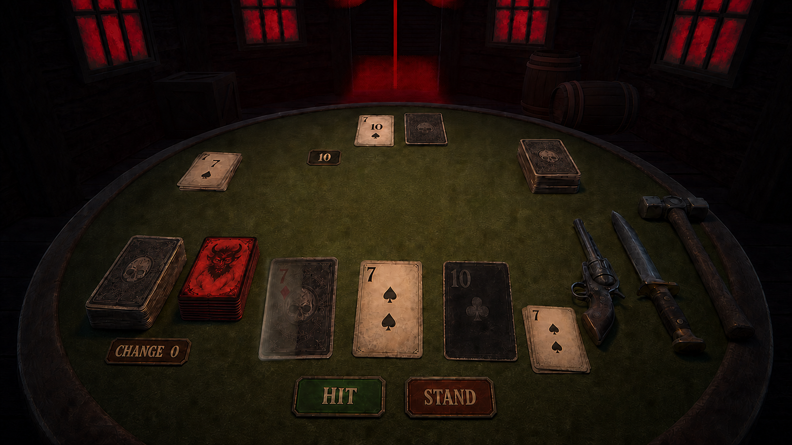
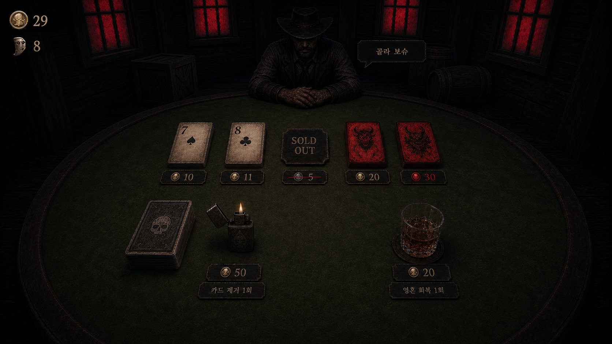

# 데블랙잭 씬·오브젝트 연출 기획서

> 책임자: 이천서  
> 버전: v1.3
> 최종 갱신: 2026-07-30
> 상태: 2.5D 전투→골드→상점 전환·계약·악마 7종 표시 범위 확정

## 1. 목적

데블랙잭의 전투·승리 골드·상점을 하나의 서부 시대 술집 테이블에서 자연스럽게 연결하기 위한 화면, 카메라, 월드 오브젝트와 UI 기준을 정의한다. 본 문서는 게임 규칙을 변경하지 않으며, 기존 런·전투 시스템을 최종 플레이 화면으로 표현하는 기준이다.

## 2. 확정된 방향

| 항목 | 결정 |
| --- | --- |
| 행동 표시 | 플레이어 행동 텍스트·상태 연출은 제거하고, 적 행동 텍스트와 공격 반응 스프라이트만 표시한다. 전투 상태별 색조·크기 변화는 사용하지 않으며 상점 상인 연출은 유지한다. |
| 화면 형식 | 3D 공간과 평면 카드를 결합한 2.5D |
| 카메라 | 플레이어가 테이블에 앉은 고정 시점 |
| 카드 | 테이블에 놓이는 얇은 3D 월드 오브젝트 |
| 덱·버린 카드 더미 | 높이가 있는 3D 월드 오브젝트 |
| 카드 정보 | 카드 표면의 숫자·이름과 화면 UI의 상세 설명을 병행 |
| 무기 | 리볼버·보위 나이프·위협용 해머를 3D 연출 오브젝트로 사용 |
| 상점 | 같은 테이블에서 적 대신 상인이 등장해 상품을 펼침 |
| 적 표현 | 프로필별 정지 스프라이트 3종(기본·공격 위기·공격받음)을 우선 사용 |

## 3. 씬 구성 원칙

최종 게임은 초기화, 메인 메뉴와 런 화면을 분리하되, 런 도중 전투·골드 정산·상점마다 별도의 장소로 이동하지 않는다.

- `Bootstrap`: 공통 데이터, 저장, 사운드와 화면 전환 초기화
- `MainMenu`: 새 게임, 이어하기, 설정과 종료
- `Run`: 상대 선택, 전투, 보상, 상점, 보스와 결과를 같은 술집 공간에서 처리

정식 런은 `StageTest`의 진행·상점 화면과 `GameScene`의 월드 공간 전투 화면을 왕복한다. `CoreLoopTest`는 독립 규칙·IMGUI 검증용으로 유지하며, 두 전투 화면 모두 규칙 로직을 복제하지 않고 기존 세션과 공개 API를 연결한다.

## 4. 테이블 배치

| 화면 위치 | 월드 오브젝트 |
| --- | --- |
| 상단 중앙 | 적 또는 상인, 적 공개 카드와 비공개 카드, 적 `공개 카드 합` |
| 좌측 상단 | 상대 시점의 오른쪽에 해당하는 적 버린 카드 더미 |
| 우측 상단 | 적 덱 |
| 중앙 | 카드 효과와 선택 연출을 위한 공용 공간 |
| 좌측 하단 | 서로 구분되는 플레이어 일반 카드 덱과 악마 카드 덱 |
| 하단 중앙 | 왼쪽부터 플레이어 비공개 카드, 공개 카드들, 비공개 역할 포함 `총합`과 제외한 `공개 카드 합` |
| 플레이어 앞 계약 영역 | 선택한 악마 카드의 월드 오브젝트와 현재 계약 상태 |
| 우측 하단 | 플레이어 버린 카드 더미 |
| 우측 가장자리 | 평소 숨겨 두었다가 카드 효과의 준비·판정 단계에 등장하는 리볼버, 보위 나이프와 위협용 해머 전용 구역 |
| 최하단 | 히트와 스탠드 입력 |

카드는 지정 위치에서 좌우로 확장한다. 상세 효과와 선택 안내는 월드 공간을 가리지 않는 화면 UI에 표시한다.

## 5. 카드와 덱 표현

### 5.1 카드

- 카드 앞면과 뒷면을 가진 얇은 3D 오브젝트로 제작한다.
- 뽑기, 뒤집기, 공개, 사용, 버리기와 덱 복귀를 위치·회전 애니메이션으로 표현한다.
- 플레이어 비공개 카드는 손패의 왼쪽에 놓는다. 카드 뒷면을 주된 형태로 보이되, 플레이어만 원래 앞면을 반투명하게 겹쳐 확인한다.
- 선택 가능과 선택 중 상태는 외곽선·색상·높이 변화로 구분한다.
- 사용 완료 공개 카드는 현재 위치와 원래 색을 유지하고, 앞면 위에 검은 흑연 X를 남긴다. 사용 완료 전환 때 두 획을 총 0.35초 동안 순차적으로 그리며 재활성화되면 즉시 제거한다.
- 카드에 마우스를 올리거나 선택하면 화면 UI에 확대 이미지와 전체 효과를 표시한다.
- 카드를 클릭하면 해당 카드의 사용 UI를 연다.

### 5.2 덱과 버린 카드 더미

- 모든 카드를 실제로 겹치지 않고 대표 오브젝트의 높이를 남은 장수에 따라 단계적으로 변경한다.
- 일반 카드 덱과 악마 카드 덱의 맨 위에는 각각 해당 덱 전용 카드 뒷면을 표시한다.
- 정확한 잔여 장수는 덱 옆 숫자로 표시한다.
- 플레이어 일반 카드 덱과 악마 카드 덱을 호버하면 실제 남은 카드 목록을 표시하되 실제 순서는 숨긴다.
- 악마 덱 선택은 계약 시작 입력으로 사용하며 호버만으로는 상태를 변경하지 않는다.
- 적 덱을 클릭하면 공개 정보로 추론 가능한 범위 안에서 현재 남아 있을 수 있는 카드 목록만 표시한다. 실제 덱 순서와 비공개 정답은 표시하지 않는다.
- 각자의 버린 카드 더미는 상대 좌측 상단과 플레이어 우측 하단에 두며, 클릭 시 공개된 버린 카드 목록을 확인할 수 있게 한다.
- 덱이 소진되면 버린 카드 더미가 이동하고 섞인 뒤 덱 위치에 다시 쌓이는 연출을 사용한다.

### 5.3 계약 카드

- 계약을 승인하면 중앙 공용 영역에 악마 카드를 최대 2장 앞면으로 펼쳐 `발견` 방식으로 제시한다. 덱에 1장만 있으면 단일 후보로 표시한다.
- 후보 카드를 호버하면 능력과 대가를 함께 표시하고, 카드 자체를 선택 입력으로 사용한다.
- 선택한 카드는 플레이어 앞 계약 영역으로 이동해 일반 카드와 같은 크기의 앞면 카드로 유지한다.
- 사탄은 일반 카드처럼 앞면/뒷면이 바뀌는 것이 아니다. 월드 오브젝트는 계속 공개된 계약 카드로 유지하고, 별도 표시로 현재 규칙 상태가 `윗면`인지 `아랫면`인지 보여준다. 소유자 차례에는 허용된 일반 행동과 현재 면 능력을 함께 선택지로 제공한다. 일반 행동은 면을 유지하고, 능력이 성공적으로 해결된 직후에만 반대 면 표시로 전환한다.
- 활성 계약 카드를 호버하면 능력, 대가와 공개 가능한 현재 상태를 표시한다.
- 선택하지 않은 카드가 있으면 악마 버린 카드 더미로 이동한다.
- 프로토타입 계약 후보에는 확정된 악마 7종만 표시한다. 제외된 루시퍼의 5장 연출은 비활성 구현으로 보존한다.

## 6. 무기 연출

- 리볼버, 보위 나이프와 위협용 해머는 테이블 우측 가장자리의 전용 구역을 사용하되 평소에는 숨기고 해당 카드 효과가 시작되면 등장시킨다.
- 해당 카드 효과가 처리되면 무기 오브젝트가 준비 동작과 결과 동작을 연속 재생한 뒤 다시 숨는다.
- 플레이어 리볼버는 카드 사용 승인 직후 등장해 준비하고, 숫자 선택 UI를 함께 표시한 뒤 상대 비공개 카드를 향해 성공 또는 실패 사격을 한 번 재생한다.
- 리볼버 준비 단계는 `PlayerTurnStart`, 판정 단계는 `PlayerSuccess` 또는 `PlayerFail` Animator 트리거를 사용한다.
- 레비아탄의 첫 예측이 성공하면 성공 연출로 끝내고 추가 선택을 열지 않는다.
- 레비아탄의 첫 예측이 실패하면 실패 연출을 끝낸 뒤 리볼버 준비 상태와 숫자 선택을 다시 열며, 두 번째 판정은 일반 리볼버의 성공·실패 연출로 끝낸다.
- 보위 나이프는 상대의 선택을 압박하고 강제 드로우를 유발하는 위협 연출로 표현한다.
- 위협용 해머는 상대의 선택한 공개 카드를 강타해 버리고, 상대가 스탠드 상태라면 그 상태와 비공개 카드를 함께 무너뜨리는 연출로 표현한다.
- 무기 연출은 판정 결과를 바꾸지 않으며 규칙 처리 결과를 시각화한다.

## 7. 화면 상태 전환

### 7.1 상대 선택

테이블 위에 상대 후보 2명의 초상, 이름, 등급, 영혼, 성향, 대표 카드와 예상 골드를 표시하는 선택 오브젝트를 놓는다.

### 7.2 전투

상대가 맞은편에 등장하고 양측 카드·덱·버린 카드 더미를 배치한다. 전투 행동과 정보 UI를 활성화한다.

### 7.3 보상

전투 오브젝트와 입력을 정리하고 획득 골드 결과를 짧게 표시한 뒤 같은 테이블을 상점으로 전환한다. 별도의 카드 보상 3장과 선택·건너뛰기 화면은 정식 런에서 표시하지 않는다.

### 7.4 상점

적을 퇴장시키고 같은 자리에 상인을 작고 어둡게 등장시켜 테이블과 상품이 화면의 주체로 남게 한다. 전투와 같은 고정 카메라, 탁한 녹색 테이블, 검정과 붉은색 중심의 무거운 분위기를 유지한다.

- 테이블 상단 상품열은 왼쪽 일반 카드 3칸, 오른쪽 악마 카드 2칸으로 고정한다.
- 각 카드 재고는 1개이며 구매한 슬롯은 카드를 치우고 `SOLD OUT` 표지를 놓는다. 방문 전체 구매 횟수는 제한하지 않아 골드가 충분하면 남은 슬롯을 모두 살 수 있다.
- 새로고침과 재입고는 제공하지 않는다.
- 좌측 하단 플레이어 덱을 선택하면 일반 카드 목록을 열고, 라이터로 카드 1장을 제거할 수 있다. 라이터는 방문당 1회다.
- 우측 하단 위스키는 방문당 1회 이용하는 영혼 회복 서비스다. 같은 방문에서 라이터와 위스키를 각각 한 번씩 모두 이용할 수 있다.
- 둘 중 하나 이상을 이용한 방문 뒤에는 다음 상점에서 라이터와 위스키 가격을 모두 같은 한 단계만 올려 표시한다. 두 서비스를 모두 이용해도 상승 표시는 한 단계다.
- 일반 상점 화면과 라이터 카드 선택 화면에는 구매 없이 진행할 수 있는 `나가기` 버튼을 제공한다.
- 현재 골드와 영혼은 좌측 상단에 표시하고, 구매할 수 없는 가격만 빨간색으로 표시한다.
- 콘셉트 이미지의 가격과 영혼 수치는 화면 예시이며 실제 가격과 위스키 회복량은 미정이다.
- 상인은 간단한 대사 말풍선을 표시할 수 있으나 상품의 판독과 조작을 가리지 않는다.

### 7.5 보스

같은 공간을 유지하되 조명, 음악, 배경 인물과 테이블 장식을 보스 전용 상태로 전환한다.

### 7.6 적 프로필 스프라이트

- `GameScene`의 적 자리는 `EnemyCharacter` 프리팹 하나를 재사용하고 전투 프로필 키로 스프라이트 세트를 선택한다.
- `cowardly-gambler`, `gunslinger`, `cultist`, `trickster`, `enforcer`, `final-boss` 여섯 프로필에 기본·공격 위기·공격받음 스프라이트를 각각 연결한다.
- 일반 행동·스탠드·승패·숫자 버스트는 기본 스프라이트를 사용한다.
- 리볼버 대상은 성공 판정 뒤에도 실제 총알이 발사되기 전까지 공격 위기 스프라이트를 유지하고, 성공 사격 애니메이션의 총구 화염 프레임에만 공격받음 스프라이트로 전환한다.
- 보위 나이프 대상은 나이프 생성·조준부터 결과 확인까지 공격 위기 스프라이트를 유지한다. 공개 합 버스트로 명중이 확정된 경우에도 실제 나이프 충격 프레임에만 공격받음으로 전환하고, 비버스트 폐기인 빗나감에는 공격받음을 사용하지 않는다. 나이프 연출은 현재 카메라를 유지하며 상대 카드 뷰를 강제로 열지 않는다. 위협용 해머는 카드 제거 연출만 재생하고 상대 표정을 바꾸지 않는다.
- 리볼버 예측 실패처럼 공격이 빗나가면 공격받음 스프라이트로 전환하지 않는다.
- 상점 진입 시 상인 스프라이트로 교체하고 퇴장 시 직전 전투 표정으로 복원한다.
- 독립 `GameScene`에서는 직렬화된 프로필 키가 스프라이트뿐 아니라 실제 최대 영혼·덱·AI·계약·체인지·독극물·보스 계약 단계까지 같은 프로필 설정으로 생성되게 한다.
- 프로필 키와 스프라이트 참조는 Unity 프리팹 경계에만 두고 `CoreLoop`·`StageProgression` 순수 규칙에는 `Sprite` 참조를 추가하지 않는다.

### 7.7 자동 발동 카드·악마 카드 스프라이트

- 자동 발동 카드 원본은 `AutoCard_01=부활초`, `02=독극물`, `03=회중시계`, `04=거짓말 탐지기`, `05=화염 방사기`로 사용한다.
- 기존 악마 카드 원본 12장의 에셋 매핑은 보존한다. 프로토타입 표시 대상은 `DevilCard_01=사탄`, `02=마몬`, `04=벨페고르`, `05=바알제붑`, `07=아스모데우스`, `10=아자젤`, `11=바포메트` 7장으로 한정한다. 나머지 원본은 런타임 후보·상점·적 덱에 표시하지 않는다.
- 원본 번호는 카드 숫자나 카탈로그 등록 순서와 일치하지 않으므로 정의 키→원본 번호 매핑을 `GameSceneCardVisualCatalog` 한 곳에서 관리한다.
- 공개된 자동 카드는 플레이어·적 손패 모두 전용 앞면을 사용한다. 미공개 적 비공개 카드는 정의 키도 화면 모델에 전달하지 않는다.
- 상점 악마 카드와 전투 중 계약 후보는 같은 악마 매핑과 `DemonCard.prefab`의 직렬화된 스프라이트를 공유한다.
- 자동 카드 5장 참조와 기존 악마 카드 12장 에셋 참조는 프리팹에 보존하되, 악마 런타임 콘텐츠 필터는 확정 7종만 허용한다. 순수 규칙 계층에는 `Sprite`를 전달하지 않는다.

## 8. UI 분리 원칙

다음 항목은 화면 UI로 표시한다.

- 양측 영혼과 합계
- 플레이어 골드
- 카드 상세 효과
- 히트와 스탠드 입력
- 플레이어 비공개 카드에 연결된 체인지 입력과 현재 누적 영혼 비용
- 일반 카드 덱과 분리된 악마 카드 덱에 연결된 계약 입력
- 덱 호버 카드 목록과 덱별 전용 뒷면
- 중앙의 계약 후보 최대 2장 및 후보별 능력·대가 호버 정보
- 플레이어 앞 활성 계약 카드와 능력·대가
- 적 추론 정보
- 선택 안내와 최근 처리 결과
- 상점의 일반 3장·악마 2장 고정 슬롯, 가격, 구매 가능 여부, `SOLD OUT`과 거래 결과
- 라이터·위스키의 방문당 1회 사용 가능 여부와 공통 가격 상승 단계
- 상점 `나가기` 입력
- 체인지는 플레이어 비공개 카드 가까이에 배치한다. 첫 사용은 무료이며 같은 전투에서 완료할 때마다 다음 비용을 영혼 1, 2, 3 순서로 높인다.

월드 오브젝트는 공간감과 직접 조작감을 담당하고, 화면 UI는 정확한 정보 전달을 담당한다.

## 9. 보류 사항

- 정지 스프라이트 MVP 이후 파츠 애니메이션 또는 3D 캐릭터로 확장할지
- 무기가 인물을 직접 공격할지 카드·테이블을 통해 상징적으로 표현할지
- 카메라 흔들림, 줌과 초점 이동의 허용 범위
- 상인의 외형, 상품 제시 동작과 상점 전용 소품

현재는 정지 스프라이트를 기본 표현으로 확정하되, 프로필 선택과 표정 상태를 `CharacterView`에 격리해 이후 표현 방식 변경이 전투 규칙을 침범하지 않게 한다.

## 10. GSV-03 덱 카드 검사창

- 플레이어의 `뽑을 카드`·`버린 카드` 더미는 호버 텍스트 대신 클릭 가능한 카드 검사창을 연다.
- 검사창은 `DeckPreviewOverlay.prefab` 기반 Screen Space Overlay uGUI다. `Card.prefab`의 앞면 스프라이트를 5열 `ScrollRect` 그리드에 표시하고 휠·드래그로 연속 스크롤한다.
- 카드 슬롯 100개는 `DeckPreviewOverlay.prefab` 안에 미리 배치한다. `GameScene`에는 이를 기반으로 만든 단일 `UIDeckPreview`와 `GameManager.deckPreview` 참조를 직렬화하며 런타임에 검사창이나 슬롯을 생성하지 않는다.
- `UIDeckPreview`는 평소 비활성 상태다. 더미 클릭 시 오브젝트 자체를 활성화하고, 배경 클릭·`ESC`·닫기 버튼·상점 진입·재시작·매니저 비활성화 시 다시 비활성화해 재사용한다. 에디터 로드·컴파일 후 자동 설치는 수행하지 않는다.
- 카드 목록은 종류·숫자·무늬·ID의 안정 순서다. 내부 더미 및 다음 드로우 순서는 표시하지 않는다.
- 열린 동안 전투 입력과 `W`·`S` 카메라 전환을 차단한다. 카드 호버는 검사창 상단 이름·효과 설명을 갱신하고, 배경 클릭·`ESC`·닫기 버튼으로 닫는다.
- 검증: 전용 `GameSceneDeckPreviewTests` 3/3, 전체 EditMode 749/749 통과. GameScene Play Mode에서 단일 `UIDeckPreview`가 뽑을 카드 18장으로 활성화되고 카메라 입력 잠금 수가 1이 되는지, 직접 닫은 뒤 오브젝트가 비활성화되고 다음 프레임 잠금 수가 0으로 복구되는지 확인했다. Console Error/Warning 0.

## 10.1 GSH-01 전투 HUD

- `HUD.prefab`의 `CombatControls`는 고정 `Hit`·`Stand`·`Change`·`Contract` 버튼 행을 두지 않고, 행동 툴팁·선택 모달·자동 카드 결과·계약 후보 상세만 소유한다.
- `Table Controller.prefab`의 `CombatCommands`는 테이블 중앙에 아이보리 실선 영역 `HIT`·`STAND`·`CHANGE -N` 3개를 배치한다. 계약서 오브젝트와 입력은 별도 팀 변경이 소유한다.
- 월드 명령은 `Actions` 모드에서만 표시한다. 사용 가능 상태는 아이보리, 호버는 혈색, 사용 불가는 회색 35%로 표시하고 콜라이더를 비활성화한다. 상점·선택 모달·카드 연출 중에는 그룹 전체를 숨긴다.
- 툴팁은 카드 호버 배지와 분리한다. 월드 오브젝트 중심을 화면 좌표로 투영해 행동 의미와 `ChangeActionText`의 현재 영혼 비용/불가 사유를 표시한다.
- 선택 모달은 프리팹에 미리 배치한 스크롤 가능 슬롯 100개를 재사용한다. 계약 후보는 기존 테이블 월드 카드와 HUD 상세를 유지하며, 런타임 전용 UI 오브젝트를 생성하지 않는다.
- `GameManager`는 New Input System 포인터 레이캐스트로 카드·덱과 함께 테이블 명령을 감지하고, 유효 클릭을 기존 `HandleCombatCommand` → `ProcessInput` → `Try*` 경로로 전달한다. 전투용 `OnGUI`·즉시형 그리기는 제거했고, 상점·라이터 선택 패널만 `OnGUI`로 유지한다.
- 카드 호버 툴팁의 헤더·본문·스타일은 독립 `CardHoverTooltip.prefab`이 소유하고 `HUD.prefab`은 이를 중첩 프리팹으로 1개만 재사용한다. 일반·악마 카드 프리팹의 기존 상단/하단 Anchor를 화면 좌표로 투영하며 추가 Screen Offset 없이 해당 Anchor에 툴팁 피벗을 정확히 맞춘다. 카드마다 UI 인스턴스를 만들지 않으며, Card/DemonCard 프리팹 루트를 선택하면 Scene View에서 TOP은 청록색, BOTTOM은 주황색 Gizmo로 생성 위치를 미리 본다.
- 검증: `GameSceneCombatHudPresentationTests` 18/18, 전체 EditMode 850/850 통과, GameScene validation 0 issues. 1280×720·1920×1080에서 세 영역·손패·합계·덱의 비겹침을 확인했고, 실제 포인터 입력으로 HIT 카드 2→3장, STAND 라운드 1→2, CHANGE 선택 상태 전환을 확인했다. 신규 컴파일·런타임 오류는 0건이며, 기존 `SettingsSystem` 비루트 `DontDestroyOnLoad`와 URP property drawer Console 오류는 별도 잔존한다.

## 11. 완료 기준

- 2.5D 테이블에서 양측 카드·덱·버린 카드 더미의 위치가 겹치지 않는다.
- 고정 카메라에서 카드 숫자와 핵심 상태를 판독할 수 있다.
- 일반·악마 덱의 뒷면과 호버 목록을 구분하고 실제 덱 순서를 노출하지 않는다.
- 계약 후보 1~2장과 선택된 활성 계약 카드의 능력·대가를 호버로 확인할 수 있다.
- 카드 상세 정보는 화면 UI를 통해 완전히 확인할 수 있다.
- 전투에서 보상과 상점으로 전환할 때 별도 장소 이동 없이 오브젝트가 안전하게 교체된다.
- 상인이 적과 같은 자리를 공유하되 전투 입력과 상점 입력이 동시에 활성화되지 않는다.
- 일반 카드 3칸과 악마 카드 2칸이 고정 위치에서 구분되고 구매한 칸만 `SOLD OUT`으로 바뀐다.
- 골드 부족 가격, 라이터·위스키 사용 완료 상태와 현재 공통 가격 단계를 한눈에 구분할 수 있다.
- 구매하지 않거나 라이터 카드 선택 중이어도 `나가기`로 상점을 끝낼 수 있다.
- 무기 연출이 판정과 입력 잠금 상태에 맞춰 한 번만 실행된다.
- 여섯 적 프로필의 기본·공격 위기·공격받음 스프라이트가 실제 전투 프로필과 일치하고 상점 왕복 뒤에도 정상 복원된다.
- 자동 카드 5종과 프로토타입 악마 카드 7종이 정의 키에 맞는 고유 앞면을 사용하고, 계약 후보도 같은 악마 이미지를 표시한다.

## 12. 변경 기록

| 날짜 | 작성자 | 변경 내용 |
| --- | --- | --- |
| 2026-08-01 | 이천서 | 사탄 입력을 일반 행동 또는 현재 면 능력 선택으로 개정하고, 능력 성공 시에만 윗면/아랫면 상태 표시를 전환하도록 확정했다. |
| 2026-07-31 | HONG | GSH-01 `HIT`·`STAND`·`CHANGE -N` 입력을 HUD 고정 버튼에서 테이블 실선 영역으로 전환하고 기존 레이캐스트·`ProcessInput`·`Try*` 경로를 재사용했다. 계약서 오브젝트와 입력은 별도 팀 변경 소유로 분리했다. 전용 18/18, 전체 EditMode 850/850, GameScene validation 0 issues와 1280×720·1920×1080 배치 및 세 행동 실제 포인터 전환을 확인했다. 기존 `SettingsSystem`·URP Console 오류는 별도 잔존한다. |
| 2026-07-31 | HONG | GSH-01 후속으로 `cardHoverBadgeScreenOffset`을 제거하고 툴팁 피벗을 카드 TOP/BOTTOM Anchor 좌표에 직접 배치했다. Card/DemonCard 프리팹용 Editor Anchor Gizmo를 추가했으며 전용 EditMode 2/2, 현재 전체 EditMode 811/811 및 GameScene validation 0 issues를 확인했다. 기존 셰이더 property drawer Console 오류는 별도 잔존한다. |
| 2026-07-31 | HONG | CU-M10 사용 완료 공개 카드의 전체 흑색 처리를 폐기하고 원본 색 위에 0.35초 동안 그려지는 검은 흑연 X 표시로 교체하도록 확정 |
| 2026-07-31 | HONG | GSH-01 카드 호버 툴팁 계층을 `CardHoverTooltip.prefab`으로 분리하고 `HUD.prefab`에 중첩 연결했다. 기존 `GameHudView` 직렬화 참조 5개와 카드 Anchor 추적은 유지했으며, 신규 프리팹 구조 검증 포함 전체 EditMode 822/822 및 GameScene validation 0 issues를 확인했다. 기존 셰이더 property drawer Console 오류는 별도 잔존한다. |
| 2026-07-30 | 이천서 | RFM02 화면 책임을 정정했다. GameScene 직접 실행은 별도 진행·선택 오버레이 없이 기존 월드 전투 화면을 즉시 표시한다. 이미 활성화된 진행 전투를 전달받은 경우에만 선택 상대 전투와 런 HUD를 사용한다. StageTest는 기존 테스트 진행 화면으로 유지한다. |
| 2026-07-30 | HONG | GSH-01 선택 모달의 스텐실 마스크 때문에 체인지 후보 버튼이 보이지 않던 문제를 `RectMask2D`로 교체해 수정했다. 체인지와 계약 후보를 같은 불투명 텍스트 버튼 목록으로 통일했으며 전용 EditMode 6/6, 체인지 후보 1280×720 표시, Console Error 0을 확인했다. |
| 2026-07-30 | HONG | GSH-01 전투 입력을 `HUD.prefab` uGUI로 이관했다. 하단 4개 Brush 버튼, 카드 호버와 분리된 행동 툴팁, 100개 고정 선택 슬롯, 계약 후보 2칸과 자동 결과 패널을 추가했으며, 전투 `OnGUI`는 제거하고 상점·라이터 선택만 남겼다. 전용 6/6, 전체 EditMode 767/767 및 1280×720·1920×1080 HUD 캡처, Console Error/Warning 0을 확인했다. |
| 2026-07-30 | HONG | 전투 행동 표시는 플레이어 텍스트·상태 연출을 제거하고, 적 행동 텍스트·공격 반응 스프라이트만 유지하도록 단순화했다. 전투 색조·크기 변화는 제거했으며 상점 상인 색조·축소와 퇴장 뒤 기본값 복원은 유지한다. EditMode 신규 검증 1/1, 전체 761/761 통과 및 GameScene 누락 참조 0건을 확인했다. |
| 2026-07-30 | 이천서 | CU-M09에서 위협용 해머의 상대 표정 반응을 제거하고, 리볼버 성공 판정부터 실제 총구 화염 프레임 전까지 공격 위기를 유지한 뒤 해당 프레임에만 공격받음으로 전환하도록 확정 |
| 2026-07-30 | HONG | GSV-03 씬 구성을 단일 `UIDeckPreview`의 Active/Inactive 재사용 방식으로 정리하고 에디터 자동 설치를 제거했다. 검사창이 열린 동안 `W`·`S` 카메라 전환도 잠그도록 입력 경계를 보강했다. 전용 EditMode 3/3, 전체 EditMode 749/749 및 GameScene 활성화·잠금·직접 닫기·잠금 복구를 확인했다. |
| 2026-07-30 | HONG | GSV-03 검사창을 `DeckPreviewOverlay.prefab` 기반 uGUI 5열 연속 스크롤로 교체했다. `Card.prefab` 앞면 스프라이트, 프리팹 내 사전 배치 슬롯 100개, 안정 정렬·모달 입력 차단·호버 설명·닫기 동작을 확정했다. 전용 EditMode 5/5, 전체 EditMode 735/735 및 GameScene 18장 스크롤·닫기 확인. |
| 2026-07-30 | 이천서 | 정식 런 화면 경계는 `StageTest → GameScene → StageTest`로 유지한다. 다만 GameScene을 직접 실행한 경우에는 진행 화면으로 간주하지 않고 기존 독립 전투·임시 상점 흐름을 즉시 시작한다. |
| 2026-07-30 | 이천서 | 정식 런의 전투 보상 화면을 제거하고 승리 골드 표시 뒤 같은 테이블에서 바로 상점으로 전환하도록 연출 기준을 개정했다. 자동 발동 카드는 상점 일반 상품 슬롯에서 전용 스프라이트로 표시한다. |
| 2026-07-30 | 이천서 | GSV-02 자동 카드 5종의 도상 대조와 악마 카드 12종의 프로젝트 확정 순서를 비순차 매핑으로 고정하고, 손패·상점·계약 후보 공용 표시와 미공개 적 카드 키 비노출 기준 확정 |
| 2026-07-30 | 이천서 | 적 스프라이트 3종의 의미를 기본·공격 위기·공격받음으로 정정하고, 일반 패배/버스트가 아닌 공격 대상 지정·성공 처리 시점에만 반응하도록 전환 기준 확정 |
| 2026-07-29 | 이천서 | GSV-01에서 적 6종 기본·공격 위기·공격받음 스프라이트와 상인 스프라이트를 `EnemyCharacter` 프리팹에 연결하고 독립 GameScene의 표시 프로필과 실제 전투 구성을 일치시킴 |
| 2026-07-29 | 이천서 | Notion v0.7 적 6종의 새 능력·계약 표시 후속을 명시하고, 사탄을 일반 카드 앞뒷면 전환이 아닌 공개 계약의 윗면/아랫면 규칙 상태 표시로 정정 |
| 2026-07-29 | 이천서 | CU-M07 레비아탄 리볼버의 첫 성공 즉시 종료와 첫 실패 연출→준비 재등장→두 번째 예측→최종 결과 흐름을 확정 |
| 2026-07-29 | 이천서 | 상시 무기 장식 기준을 현행 GameScene에 맞춰 효과 시작 시 등장하는 방식으로 개정하고, 리볼버의 준비→숫자 선택→성공/실패 사격 흐름을 확정 |
| 2026-07-29 | 이천서 | 상점 카드의 방문 전체 구매 제한을 없애고, 라이터·위스키 독립 1회 이용과 다음 방문 공통 가격 상승, 무료 `나가기` 표시 기준을 확정 |
| 2026-07-29 | 이천서 | 플레이어 합계를 비공개 역할 포함 `총합`과 제외한 `공개 카드 합` 두 줄로 표시하고 적은 공개 합만 유지하도록 현행 GameScene 기준 반영 |
| 2026-07-26 | 이천서 | 일반·악마 덱의 전용 뒷면·호버 목록, 발견형 후보 3장과 플레이어 앞 활성 계약 카드 연출 확정 |
| 2026-07-26 | 이천서 | 일반 계약 후보를 최대 2장으로 축소하고 악마 덱 1장일 때 단일 후보로 표시하는 연출 확정 |
| 2026-07-22 | 이천서 | 기존 전투 화면의 어두운 2.5D 분위기를 유지한 상점 콘셉트와 일반 3·악마 2 고정 슬롯, `SOLD OUT`, 라이터·위스키 조작 기준 확정 |
| 2026-07-21 | 이천서 | 중앙 계약 오브젝트를 제거하고 일반 카드 덱과 별도 악마 카드 덱을 배치하며, 판매 카드 5장·개별 재고·1회 휴식·새로고침 없음의 상점 연출 기준 반영 |
| 2026-07-21 | 이천서 | 폴드 UI 삭제, 체인지를 비공개 카드 연동 행동으로 유지하고 전투 내 누적 영혼 비용 표시 확정 |
| 2026-07-21 | 이천서 | 양측 덱·버림패, 플레이어 비공개·사용 완료 카드, 계약 영역, 행동 버튼과 상시 무기 장식의 테이블 배치 확정 |
| 2026-07-21 | 이천서 | 고정 카메라 2.5D 술집 테이블, 월드 카드·덱, 3D 무기와 동일 테이블 상점 방향 확정 |
| 2026-08-03 | 이천서 | CU-M14 보위 나이프를 생성·조준·결과 확인·명중/빗나감 순서로 연결하고 조준 중 공격 위기, 실제 충격 프레임에서만 공격받음으로 전환하도록 확정. 리볼버도 발사 전 공격 위기 유지 기준을 회귀로 재고정 |
| 2026-08-03 | 이천서 | 마몬 주사위 전용 프리팹이 없는 현재 범위에서는 GameScene 상단 중앙에 플레이어·상대의 공개 주사위 눈을 임시 표기한다. `Dice.fbx` 기반 프리팹 완성 후 같은 표시 경계를 3D 연출로 교체한다. |
